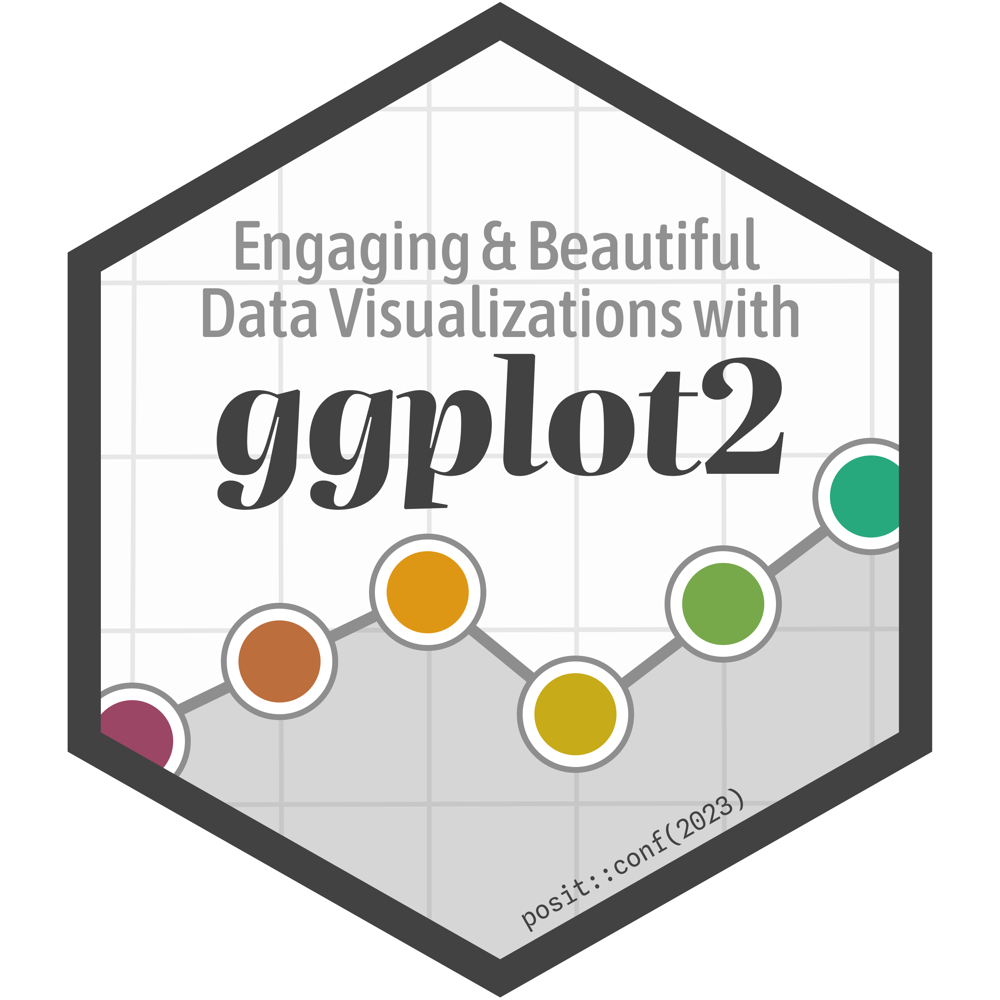

{style="float:right;padding: 0 0 0 10px;" fig-alt="Logo del Curso" width="185"}

Un Curso de Introducción por Paul Efren Santos Andrade

------------------------------------------------------------------------

<span class='code'>📆 &ensp;Febrero, 2026</span>\

------------------------------------------------------------------------

# Descripción General del Curso

Este curso proporciona una introducción completa a la programación con R utilizando el ecosistema Tidyverse. Aprenderás conceptos básicos de R usando el IDE RStudio, escritura de códigos legibles y reproducibles, y conceptos básicos de ciencia de datos.

## Aprenderemos

* Conceptos básicos de R usando el IDE RStudio (Entorno de desarrollo integrado)
* Escritura de códigos legibles y reproducibles
* Conceptos básicos de ciencia de datos
* Importación y manipulación de datos con Tidyverse
* Limpieza y transformación de datos con dplyr y tidyr
* Manejo de datos espaciales con sf

## Programas Necesarios

Es necesario tener instalados:

1. Una versión reciente de R (~4.5.2), disponible de forma gratuita en [cran.r-project.org](http://www.cran.r-project.org)
2. Una versión reciente de RStudio IDE (~1.1.401), disponible en [posit.co/download/](https://posit.co/download/rstudio-desktop/)
3. [Rtools (45)](https://cran.r-project.org/bin/windows/Rtools/)

## Paquetes Necesarios

```r
packages <- c("tidyverse", "janitor",
              "here", "writexl", "readxl", "sf", "pdftools")
install.packages(packages)
```

## ¿Es este curso para mí?

Este curso será apropiado para ti si:

* Deseas aprender a programar en R desde cero
* Quieres aprender a trabajar con datos de manera eficiente
* Te interesa la ciencia de datos y el análisis reproducible
* Necesitas herramientas para importar, limpiar y transformar datos

## Libro de Referencia

**R for Data Science**

* [Versión en inglés](https://r4ds.hadley.nz/)
* [Versión en español](https://es.r4ds.hadley.nz/)

# Instructor

**Paul Efren Santos Andrade** es un especialista en análisis de datos con R, enfocado en ciencia de datos aplicada y análisis reproducible. Tiene amplia experiencia en el uso del ecosistema Tidyverse para importación, limpieza y transformación de datos.

<div align="center">
<a href="https://paulefrensa.rbind.io"></a>&ensp;
<a href="https://twitter.com/PaulEfrenSantos"></a>&ensp;
<a href="https://github.com/PaulESantos"></a>&ensp;
</div>

