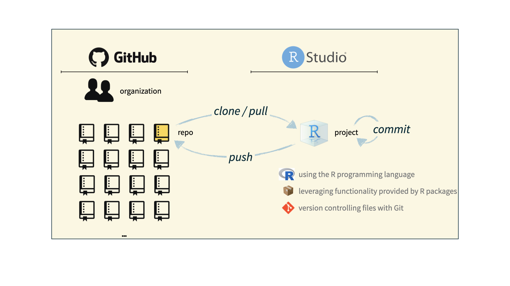

```{r}
#| label: setup
#| include: false
library(tidyverse)
```

# ¡Bienvenidos!<br><br><br> {background-color="#28a87d"}


## ¿Qué es la Ciencia de Datos?

::: incremental
-   **Ciencia de datos** es convertir datos brutos en conocimiento y comprensión
-   Aprenderemos a hacerlo de manera **ordenada** (tidy) y **reproducible**
-   Este es un curso de introducción con énfasis en:
    - Fundamentos de R
    - Manipulación de datos con tidyverse
    - Análisis espacial
:::

## El Ciclo de la Ciencia de Datos

{fig-alt="Ciclo de la ciencia de datos: Importar, ordenar, transformar, visualizar, modelar, comunicar." fig-align="center"}

# ¿Por qué R?

## R es Poderoso y Popular

::: incremental
-   **Gratuito y de código abierto**
-   **Más de 20,000 paquetes** disponibles
-   **Comunidad activa y solidaria**
-   **Excelente para visualización** (ggplot2)
-   **Reproducibilidad** con Quarto/RMarkdown
-   **Integración con datos espaciales** (sf,)
:::

## R + RStudio

::: {.columns}
::: {.column width="50%"}
{fig-alt="Logo de R" fig-align="center" width="45%"}

El lenguaje de programación
:::

::: {.column width="50%"}
{fig-alt="Logo de RStudio" fig-align="center" width="45%"}

Un programa para escribir código
:::
:::

## El Ecosistema Tidyverse

{fig-alt="Hexágonos de paquetes tidyverse" fig-align="center" width="70%"}

Una colección de paquetes para ciencia de datos

# Kit de Herramientas del Curso

## Kit de Herramientas del Curso {.smaller}

::::: columns
::: {.column width="50%"}
**Aprendizaje**

-   Materiales: Sitio web del curso
-   Libro de referencia: [R for Data Science](https://r4ds.hadley.nz/)
-   Datos: Carpeta `data/`
-   Ejercicios prácticos en cada sesión
:::

::: {.column width="50%"}
**Haciendo Ciencia de Datos**

-   Computación:
    -   Lenguaje: R
    -   IDE: RStudio
    -   Paquetes: tidyverse, sf, janitor
    -   Documentos: Quarto/RMarkdown
-   Gestión de código:
    -   Control de versiones: Git
    -   Colaboración: GitHub
:::
:::::

## Objetivos de Aprendizaje {.smaller}

Al final de este curso, serás capaz de...

::: incremental
-   Obtener conocimiento de los datos
-   Obtener conocimiento de los datos, **reproduciblemente**
-   Obtener conocimiento de los datos, reproduciblemente, **usando herramientas modernas de programación**
-   Obtener conocimiento de los datos, reproduciblemente **y colaborativamente**, usando herramientas modernas
-   Obtener conocimiento de los datos, reproduciblemente **(con código documentado y control de versiones)** y colaborativamente
:::

# R y RStudio

## R y RStudio {.smaller}

::::: columns
::: {.column width="50%"}
{fig-alt="Logo de R" fig-align="center" width="40%"}

-   R es un **lenguaje de programación** estadístico de código abierto
-   R es también un entorno para computación estadística y gráficos
-   Es fácilmente extensible con *paquetes*
:::

::: {.column .fragment width="50%"}
{fig-alt="Logo de RStudio" width="40%"}

-   RStudio es una interfaz conveniente para R llamada un **IDE** (entorno de desarrollo integrado)
-   RStudio no es un requisito para programar con R, pero es muy comúnmente usado
-   *"Escribo código R en el IDE RStudio"*
:::
:::::

## R vs. RStudio

[{fig-alt="A la izquierda: un motor de coche. A la derecha: un tablero de coche. El motor está etiquetado como R. El tablero está etiquetado como RStudio." fig-align="center"}](https://moderndive.com/1-getting-started.html)

::: aside
Fuente: [Modern Dive](https://moderndive.com/1-getting-started.html).
:::

## Paquetes de R {.smaller}

::: incremental
-   **Paquetes**: Unidades fundamentales de código R reproducible, incluyendo funciones R reutilizables, documentación y datos de muestra
-   En 2026, hay 23, 178 paquetes R disponibles en **CRAN** (Comprehensive R Archive Network)
-   ¡Trabajaremos con un subconjunto importante de estos!
:::

## Tour: R + RStudio {.smaller}

::::::: columns
:::: {.column width="50%"}
::: demo
Abre RStudio y exploraremos juntos:

-   Panel de Source (código)
-   Panel de Console (consola)
-   Panel de Environment (entorno)
-   Panel de Files/Plots/Help
:::
::::

:::: {.column width="50%"}
{fig-align="center"}
::::
:::::::

## Resumen del Tour: R + RStudio


## Libros de Referencia

::: {.columns}
::: {.column width="50%"}
### R for Data Science
{width="50%"}

-   [Versión en inglés](https://r4ds.hadley.nz/)
-   [Versión en español](https://es.r4ds.hadley.nz/)
:::

::: {.column width="50%"}
### Geocomputation with R

-   [Versión en línea](https://r.geocompx.org/)
-   Análisis geoespacial completo
:::
:::

# Preparación

## Programas Necesarios

Asegúrate de tener instalados:

::: incremental
1.  **R** (versión 4.5.2 o superior)
    -   [cran.r-project.org](https://cran.r-project.org)
2.  **RStudio** (versión 1.1.401 o superior)
    -   [posit.co/download/rstudio-desktop](https://posit.co/download/rstudio-desktop/)
3.  **Rtools 45** (solo Windows)
    -   [cran.r-project.org/bin/windows/Rtools](https://cran.r-project.org/bin/windows/Rtools/)
:::

## Paquetes Principales

```{r}
#| label: packages-install-main
#| eval: false
#| echo: true
# Tidyverse y manipulación de datos
packages <- c(
  "tidyverse",  # Colección completa
  "janitor",    # Limpieza de nombres
  "here",       # Rutas reproducibles
  "readxl",     # Leer Excel
  "writexl",    # Escribir Excel
  "visdat"      # Visualizar datos
)

install.packages(packages)
```

## Paquetes Espaciales

```{r}
#| label: packages-install-spatial
#| eval: false
#| echo: true
# Paquetes para datos espaciales
spatial_packages <- c(
  "sf",        # Simple Features (principal)
  "terra",     # Datos ráster
  "mapview",   # Visualización interactiva
  "leaflet",   # Mapas web
  "tmap"       # Mapas temáticos
)

install.packages(spatial_packages)
```

## Paquetes Adicionales

```{r}
#| label: packages-install-extra
#| eval: false
#| echo: true
# Paquetes de texto
install.packages("tm")

# stringr.plus (desde GitHub)
install.packages("remotes")
remotes::install_github("johncassil/stringr.plus")
```
# Paquetes de R

## Paquetes {.smaller}

-   Instalados con `install.packages() - pak::pak()`, **una vez por sistema**:

```{r}
#| eval: false
#| echo: true
install.packages("tidyverse")

library(pak)
pak::pkg_install("sf")
```

. . .

-   Cargados con `library()`, **una vez por sesión**:

```{r}
#| eval: false
#| echo: true
library(tidyverse)
library(sf)
```


## tidyverse

::: columns
::: {.column width="40%"}
[{fig-alt="Logos hexagonales de paquetes tidyverse"}](https://tidyverse.org)
:::

::: {.column .fragment width="60%"}
[tidyverse.org](https://www.tidyverse.org/)

-   **tidyverse** es una colección de paquetes R diseñados para ciencia de datos
-   Todos comparten una filosofía y gramática común
-   Incluye: dplyr, ggplot2, tidyr, readr, purrr, tibble, stringr, forcats
:::
:::

## Paquetes para este curso

```{r}
#| eval: false
#| echo: true
# Tidyverse y manipulación
install.packages("tidyverse")
install.packages("janitor")
install.packages("here")

# Lectura de datos
install.packages("readxl")
install.packages("writexl")

# Datos espaciales
install.packages("sf")

```


# ¡Comencemos!

## Actividad: Primer Código en R

Abre RStudio y escribe:

```{r}
#| echo: true
#| eval: false
# Mi primer código en R
print("¡Hola, Mundo!")

# Operaciones básicas
2 + 2
10 * 5

# Crear un objeto
mi_nombre <- "Tu Nombre"
mi_nombre
```

## Verificación Rápida

¿Funciona todo correctamente?

```{r}
#| echo: true
#| eval: false
# Verificar tidyverse
library(tidyverse)

# Crear un gráfico simple
ggplot(mtcars, aes(x = mpg, y = hp)) +
  geom_point() +
  theme_minimal() +
  labs(title = "Mi primer gráfico en R")
```

# Análisis Reproducible


## Kit de Herramientas para Reproducibilidad

::: incremental
-   **Programabilidad** -- Código en lugar de apuntar y hacer clic → R
-   **Programación literaria** -- Código, narrativa y salida en un lugar → Quarto/RMarkdown
-   **Control de versiones** -- Rastrear cambios con mensajes descriptivos → Git/GitHub
:::

# Git y GitHub

## Git y GitHub {.smaller}

::: columns
::: {.column .fragment width="50%"}
{fig-alt="Logo de Git" fig-align="center" width="150"}

-   Git es un sistema de control de versiones
-   Como "Control de cambios" de Word, pero mucho más poderoso
-   No es el único, pero es muy popular
:::

::: {.column .fragment width="50%"}
{fig-alt="Logo de GitHub" fig-align="center" width="150"}

-   GitHub es el hogar para proyectos Git en internet
-   Como Dropbox pero mejor
-   Usaremos GitHub para colaboración y compartir código
:::
:::


## Flujo de Trabajo con Git/GitHub

{fig-align="center"}

# Quarto

## Quarto para Documentos Reproducibles

::: incremental
-   Reportes completamente reproducibles
-   Cada vez que renderizas, el análisis se ejecuta desde el principio
-   El código va en celdas (chunks)
-   La narrativa va fuera de las celdas
-   Opcional: Editor visual para experiencia similar a Word/Google Docs
:::

## Ejemplo de Quarto

````markdown
---
title: "Mi Análisis"
format: html
---

## Introducción

Este es un análisis de datos de planes urbanos.

```{{r}}
library(tidyverse)
planes <- read_csv("data/catalogo_planes.csv")
summary(planes)
```
````

## Contacto

::: {.columns}
::: {.column width="50%"}
**Paul Efren Santos Andrade**

📧 [Correo electrónico]

🌐 [paulefrensa.rbind.io](https://paulefrensa.rbind.io)

🐦 [@PaulEfrenSantos](https://twitter.com/PaulEfrenSantos)

💻 [github.com/PaulESantos](https://github.com/PaulESantos)
:::

::: {.column width="50%"}
{fig-align="center" width="60%" style="border-radius: 50% / 35%; object-fit: cover;"}
:::
:::


