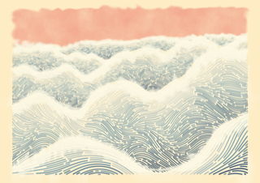
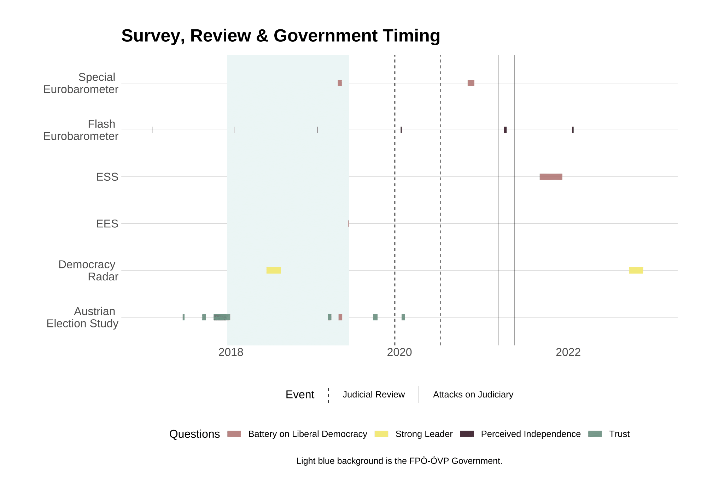

# Bienvenido<br><br><br><br><br><br> {background-image="img/logo-welcome.png" background-position="center" background-size="40%"}


##  {#hello-blank data-menu-title="Hola" background-image="img/intro/hello-blank.png" background-position="center" background-size="62%"}


##  {#hello-team data-menu-title="Hola Equipo" background-image="img/intro/hello-team.png" background-position="center" background-size="62%"}


##  {#teaching-team data-menu-title="Equipo Docente" background-image="img/intro/team-hex-grid.png" background-position="center" background-size="105%"}


##  {#hello-cedric data-menu-title="Hola Cédric" background-image="img/intro/hello-cedric.png" background-position="center" background-size="62%"}


##  {#cedric-avatars data-menu-title="Avatares de Cédric" background-image="img/intro/avatars-logo.png" background-position="center" background-size="80%"}


##  {#cedric-dataviz-science data-menu-title="Proyectos de Cédric Ciencia" background-image="img/intro/projects-science.png" background-position="center" background-size="82%" background-color="#ABABAB"}

::: footer
:::


##  {#cedric-dataviz-clients data-menu-title="Proyectos de Cédric Clientes" background-image="img/intro/projects-clients.png" background-position="center" background-size="77%" background-color="#ABABAB"}

::: footer
:::


##  {#cedric-dataviz-personal data-menu-title="Proyectos de Cédric Personal"background-image="img/intro/projects-personal.png" background-position="center" background-size="85%" background-color="#ABABAB"}

::: footer
:::


##  {#cedric-blog data-menu-title="Blog de Cédric "background-image="img/intro/blog.png" background-position="center" background-size="56%"}

::: footer
:::


##  {#cedric-ggplot-tutorial data-menu-title="Tutorial Blog de Cédric" background-image="img/intro/blog-tutorial.png" background-position="center" background-size="56%"}

::: footer
:::


## {#cedric-ggplot-tutorial-overview data-menu-title="Descripción general del tutorial de blog de Cédric"}

](img/intro/ggplot-tutorial-overview.png){fig-align="center" fig-alt="Descripción general de algunos gráficos ejemplares incluidos en mi tutorial de ggplot2."}


##  {#cedric-ggplot-evol data-menu-title="Evolución de ggplot de Cédric Blog" background-image="img/intro/blog-evol.png" background-position="center" background-size="56%"}

::: footer
:::


## {#cedric-ggplot-evol-gif data-menu-title="GIF de evolución de ggplot de Cédric Blog"}

](img/intro/evol-ggplot-1.gif){fig-align="center" fig-alt="Evolución animada de un gráfico jitter-pop mostrando proporciones estudiante-profesor por continente. La animación muestra iteración a través de diferentes geometrías, ajustes de tema, combinaciones de capas y anotaciones adicionales como etiquetas de texto con flechas y un mapa de cuadrícula de mosaicos insertado con colores por región que coinciden con los de la gráfica principal."}


##  {#cedric-rstudio-conf data-menu-title="Blog de Cédric rstudio::conf" background-image="img/intro/blog-rstudioconf.png" background-position="center" background-size="56%"}

::: footer
:::


##  {#hello-thomas data-menu-title="Hola Thomas" background-image="img/intro/hello-thomas.png" background-position="center" background-size="62%"}


## {#thomas-artwork data-menu-title="Obra de Thomas"}




##  {#hello-jasmin data-menu-title="Hola Jasmin" background-image="img/intro/hello-jasmin.png" background-position="center" background-size="62%"}


## {#jasmin-dataviz data-menu-title="Visualización de Datos de Jasmin"}




##  {#jasmin-dataviz-observable data-menu-title="Visualización de Datos de Jasmin"}

<iframe width="100%" height="1106.421875" frameborder="0"
 src="https://observablehq.com/embed/@jasminsworkspace/constitutional-regression@2225?cells=viewof+continent%2Cviewof+source%2Cviewof+Dataset%2Cviewof+Vars%2Cviewof+Democracy%2Clegend%2Cplotfinal%2Ctextbox"></iframe>


##  {#hello-jonathan data-menu-title="Hola Jonathan" background-image="img/intro/hello-jonathan.png" background-position="center" background-size="62%"}


##  {#jonathan-photography-japan data-menu-title="Fotografía de Jonathan"}


##  {#hello-course data-menu-title="Hola Curso" background-image="img/intro/hello-course.png" background-position="center" background-size="62%"}


## Iniciadores de Conversación

-   ¿Cuál es tu nombre?
-   ¿Dónde sientes que es tu hogar?
-   ¿Cuándo usaste R por primera vez?
-   ¿Cuál es tu animal / planta / color / tipografía favorito?
-   ¿Dónde pasaste tu verano?
-   ¿A quién te gustaría conocer durante posit::conf?
-   ¿Qué paquete de R esperas probar?
-   ¿Qué cosas quieres aprender sobre ggplot2?


## Anuncios

<br>

#### WiFi
-   Usuario: Posit Conf 2023
-   Contraseña: conf2023<br><br>

#### Materiales del Curso
-   Página Web: [posit-conf-2023.github.io/dataviz-ggplot2](https://posit-conf-2023.github.io/dataviz-ggplot2/)
-   Posit Cloud: [posit.cloud/spaces/397253](https://posit.cloud/spaces/397253/content/all?sort=name_asc)


## {#course-webpage data-menu-title="Página Web del Curso" .center}

<div style='text-align:center;'>
<a href="https://posit-conf-2023.github.io/dataviz-ggplot2/" style='font-family:spline sans mono;font-size:50pt;font-weight:700;'>posit-conf-2023.github.io/<br>dataviz-ggplot2</a>
</div>


## {#posit-cloud data-menu-title="Posit Cloud" .center}

<div style='text-align:center;'>
<a href="https://posit.cloud/spaces/397253/content/all?sort=name_asc" style='font-family:spline sans mono;font-size:50pt;font-weight:700;'>posit.cloud/spaces/397253</a>
</div>


## Anuncios

::: incremental
-  **Baños neutrales en cuanto al género** se encuentran entre los Baños de Grand Suite.
-  Las dos **salas de meditación/oración** (Grand Suite 2A y Grand Suite 2B) están abiertas de domingo a martes 7:30 am - 7:00 pm y miércoles 8:00 am - 6:00 pm
-  La **sala de lactancia** se encuentra en Grand Suite 1 y está abierta de domingo a martes 7:30 am - 7:00 pm y miércoles 8:00 am - 6:00 pm.
-  Los participantes que no deseen ser fotografiados tienen **cordones rojos**; por favor nota los colores de los cordones de todos antes de tomar una foto y respeta sus elecciones.
-   El **Código de Conducta** y las políticas de **COVID** se pueden encontrar en [posit.co/code-of-conduct](https://posit.co/code-of-conduct). Por favor revísalos cuidadosamente. Puedes reportar violaciones del Código de Conducta en persona, por correo electrónico o por teléfono. Consulta la política vinculada arriba para obtener información de contacto.
:::


## Estrategia de Comunicación

<br>

::: incremental
-   <b style='color:#28a87d;'>Nota adhesiva verde </b>--- He terminado el ejercicio<br><br>
-   <b style='color:#b82ca1;'>Nota adhesiva rosa </b>--- Necesito ayuda o apoyo<br><br>
-   Puedes hacer preguntas / comentar en cualquier momento durante el curso.
-   Por favor evita preguntas durante los descansos para darnos la oportunidad de recuperarnos.
-   Usaremos Discord como nuestro principal método de comunicación digital.
-   ¡Trabaja en equipo con tus vecinos para los ejercicios --- y el almuerzo!
-   Recopilaremos comentarios dos veces durante el día (más información después).
:::


# Preparación


## Paquetes Requeridos

```{r}
#| label: packages-install-tidyverse
#| eval: false
install.packages("ggplot2")
install.packages("dplyr")
install.packages("readr")
install.packages("forcats")
install.packages("stringr")
install.packages("lubridate")
install.packages("purrr")
```

::: fragment
```{r}
#| label: packages-install-other
#| eval: false
install.packages("here")
install.packages("scales")
install.packages("ragg")
install.packages("systemfonts")
install.packages("rcartocolor")
install.packages("scico")
install.packages("prismatic")
install.packages("patchwork")
install.packages("ggtext")
install.packages("ggforce")
install.packages("ggrepel")
install.packages("colorspace")
install.packages("gapminder")
remotes::install_github("clauswilke/colorblindr")
```
:::


## Paquetes Opcionales

```{r}
#| label: packages-install-optional
#| eval: false
install.packages("camcorder")
install.packages("viridis")
install.packages("RColorBrewer")
install.packages("MetBrewer")
install.packages("ggthemes")
install.packages("ggsci")
install.packages("hrbrthemes")
install.packages("tvthemes")
install.packages("ggannotate")
remotes::install_github("AllanCameron/geomtextpath")
```


## Tipografías Requeridas

Descarga e instala las siguientes tipografías:

* Asap: [fonts.google.com/specimen/Asap](https://fonts.google.com/specimen/Asap)
* Spline Sans: [fonts.google.com/specimen/Spline+Sans](https://fonts.google.com/specimen/Spline+Sans)
* Spline Sans Mono: [fonts.google.com/specimen/Spline+Sans+Mono](https://fonts.google.com/specimen/Spline+Sans+Mono)
* Hepta Slab: [fonts.google.com/specimen/Hepta+Slab](https://fonts.google.com/specimen/Hepta+Slab)

. . . 

All files are also available via<br>[cedricscherer.com/files/positconf-dataviz-ggplot2-fonts.zip](https://cedricscherer.com/files/positconf-dataviz-ggplot2-fonts.zip)

. . . 

&rarr; Install the font files. 

. . . 
 
&rarr; Restart Rstudio.


# Let's get started!
