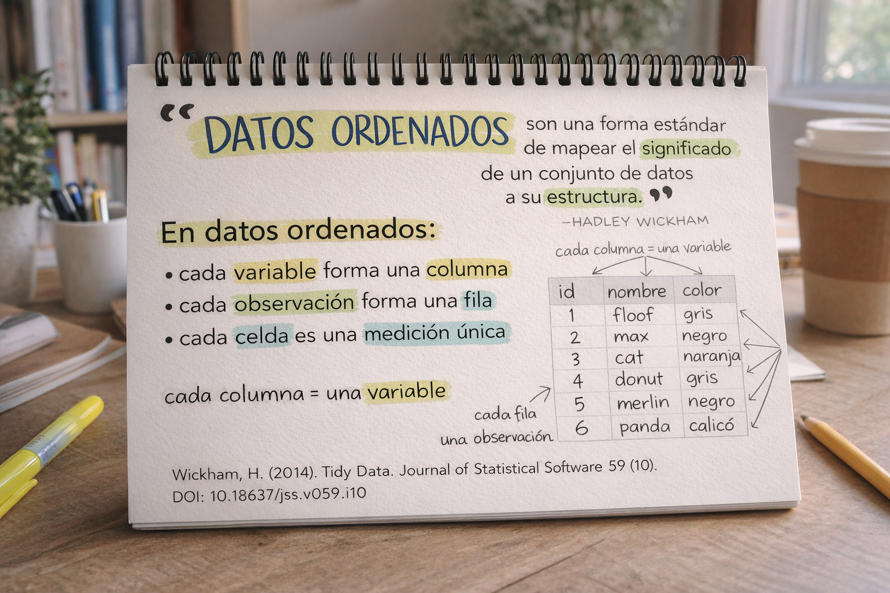

```{r}
#| label: setup
#| include: false
library(tidyverse)
ggplot2::theme_set(ggplot2::theme_gray(base_size = 16))
```

# Kit de Herramientas del Curso

## Kit de Herramientas del Curso {.smaller}

::::: columns
::: {.column width="50%"}
**Aprendizaje**

-   Materiales: Sitio web del curso
-   Libro de referencia: [R for Data Science](https://r4ds.hadley.nz/)
-   Datos: Carpeta `data/`
-   Ejercicios prácticos en cada sesión
:::

::: {.column width="50%"}
**Haciendo Ciencia de Datos**

-   Computación:
    -   Lenguaje: R
    -   IDE: RStudio
    -   Paquetes: tidyverse, sf, janitor
    -   Documentos: Quarto/RMarkdown
-   Gestión de código:
    -   Control de versiones: Git
    -   Colaboración: GitHub
:::
:::::

## Objetivos de Aprendizaje {.smaller}

Al final de este curso, serás capaz de...

::: incremental
-   Obtener conocimiento de los datos
-   Obtener conocimiento de los datos, **reproduciblemente**
-   Obtener conocimiento de los datos, reproduciblemente, **usando herramientas modernas de programación**
-   Obtener conocimiento de los datos, reproduciblemente **y colaborativamente**, usando herramientas modernas
-   Obtener conocimiento de los datos, reproduciblemente **(con código documentado y control de versiones)** y colaborativamente
:::

# R y RStudio

## R y RStudio {.smaller}

::::: columns
::: {.column width="50%"}
{fig-alt="Logo de R" fig-align="center" width="40%"}

-   R es un **lenguaje de programación** estadístico de código abierto
-   R es también un entorno para computación estadística y gráficos
-   Es fácilmente extensible con *paquetes*
:::

::: {.column .fragment width="50%"}
{fig-alt="Logo de RStudio" width="40%"}

-   RStudio es una interfaz conveniente para R llamada un **IDE** (entorno de desarrollo integrado)
-   RStudio no es un requisito para programar con R, pero es muy comúnmente usado
-   *"Escribo código R en el IDE RStudio"*
:::
:::::

## R vs. RStudio

[{fig-alt="A la izquierda: un motor de coche. A la derecha: un tablero de coche. El motor está etiquetado como R. El tablero está etiquetado como RStudio." fig-align="center"}](https://moderndive.com/1-getting-started.html)

::: aside
Fuente: [Modern Dive](https://moderndive.com/1-getting-started.html).
:::

## Paquetes de R {.smaller}

::: incremental
-   **Paquetes**: Unidades fundamentales de código R reproducible, incluyendo funciones R reutilizables, documentación y datos de muestra
-   Al 15 de febrero de 2026, hay 23, 178 paquetes R disponibles en **CRAN** (Comprehensive R Archive Network)
-   ¡Trabajaremos con un subconjunto importante de estos!
:::

## Tour: R + RStudio {.smaller}

::::::: columns
:::: {.column width="50%"}
::: demo
Abre RStudio y exploraremos juntos:

-   Panel de Source (código)
-   Panel de Console (consola)
-   Panel de Environment (entorno)
-   Panel de Files/Plots/Help
:::
::::

:::: {.column width="50%"}
{fig-align="center"}
::::
:::::::

## Resumen del Tour: R + RStudio


# Fundamentos de R

## Valores Atómicos

Los elementos básicos de R:

```{r}
#| echo: true
# Texto (character)
"cusco"
"  Cusco"

# Números (numeric)
1
1.2

# Lógicos (logical)
TRUE
FALSE
```

## Creación de Objetos

El operador usado para crear objetos es `<-`

```{r}
#| echo: true
# Crear objetos
x <- 1
x

y <- "ser"
y
```

::: callout-tip
## Atajo de teclado
En RStudio: `Alt + -` (Windows) o `Option + -` (Mac)
:::

## Vectores

Para almacenar más de un elemento usamos `c()`:

```{r}
#| echo: true
# Vector numérico
x <- c(1, 2, 3, 4, 5)
x

# Vector de caracteres
ciudades <- c("Lima", "Cusco", "Arequipa", "Trujillo")
ciudades
```

## Operadores Básicos

### Secuencia `:`

```{r}
#| echo: true
1:6
10:15
```

### Indexación `[]`

```{r}
#| echo: true
letters[1:5]
letters[c(2, 4, 6)]
ciudades[1]
```

## Operadores Lógicos {.smaller}

| Operador   | Significado  | Ejemplo        |
|------------|--------------|----------------|
| `x < y`    | menor que    | `5 < 10`       |
| `x > y`    | mayor que    | `10 > 5`       |
| `x == y`   | igual        | `5 == 5`       |
| `x <= y`   | menor igual  | `5 <= 5`       |
| `x >= y`   | mayor igual  | `10 >= 5`      |
| `x != y`   | diferente    | `5 != 10`      |
| `x %in% y` | pertenece    | `"Lima" %in% ciudades` |

## Operadores Lógicos: Ejemplos

```{r}
#| echo: true
# Comparaciones
5 < 10
10 > 5
5 == 5

# Pertenencia
"Lima" %in% ciudades
"Piura" %in% ciudades
```

## Operadores Booleanos

```{r}
#| echo: true
# Y (ambas condiciones deben ser verdaderas)
TRUE & TRUE
TRUE & FALSE

# O (al menos una debe ser verdadera)
TRUE | FALSE
FALSE | FALSE

# Negación
!TRUE
```

# Estructuras de Datos

## Tipos de Estructuras

::: incremental
-   **Vectores**: Colección de elementos del mismo tipo
-   **Matrices**: Arreglo bidimensional del mismo tipo
-   **Data frames**: Tabla con columnas de diferentes tipos
-   **Listas**: Colección de elementos de cualquier tipo
:::

## Vectores

```{r}
#| echo: true
# Vector numérico entero
x <- c(1:6)
class(x)

# Vector de caracteres
x <- c("a", "e", "i", "o", "u")
class(x)

# Vector lógico
x <- c(TRUE, TRUE, FALSE, TRUE, FALSE)
class(x)
```

## Matrices

```{r}
#| echo: true
# Matriz de números
matrix(1:10, ncol = 5)

# Matriz de letras
matrix(letters[1:15], nrow = 3)
```

## Data Frames

Los data frames son **la estructura más importante** para análisis de datos:

```{r}
#| echo: true
# Ejemplo con datos incluidos en R
head(mtcars, 3)
```

## Data Frames y Variables {.smaller}



## Tibbles

Tibbles son data frames "mejorados" del tidyverse:

```{r}
#| echo: true
# Convertir a tibble
as_tibble(mtcars)
```

## Listas

Las listas pueden contener elementos de diferentes tipos:

```{r}
#| echo: true
# Lista simple
list(
  numeros = 1:5,
  letras = c("a", "b", "c"),
  logico = TRUE
)
```

# Funciones en R

## ¿Qué son las Funciones?

Las funciones son (más a menudo) verbos, seguidos por lo que se aplicarán entre paréntesis:

```{r}
#| eval: false
#| echo: true
haz_esto(a_esto)
haz_eso(a_esto, a_eso, con_aquellos)
```

## Funciones: 

### Sintaxis

`nombre_funcion(argumento1, argumento2, ...)`

```{r}
#| echo: true
# Función mean (promedio)
x <- c(1, 2, 3, 4, 5, 6, 7, 8, 9, 100)
mean(x)

# Con argumento adicional
mean(x, trim = 0.1)
```

## Ayuda sobre Funciones

La documentación se accede con `?`:

```{r}
#| eval: false
#| echo: true
?mean
help(sum)
```

## Funciones Útiles:
### Resumen

```{r}
#| echo: true
# Longitud de un vector
length(ciudades)

# Valores únicos
unique(c(1, 2, 2, 3, 3, 3))

# Resumen estadístico
summary(mtcars$mpg)
```

## Funciones Útiles: 

### Manipulación

```{r}
#| echo: true
# Combinar vectores
c(1:3, 10:12)

# Secuencias
seq(from = 0, to = 10, by = 2)

# Repetición
rep("R", times = 3)
```

# Paquetes de R

## Paquetes {.smaller}

-   Instalados con `install.packages() - pak::pak()`, **una vez por sistema**:

```{r}
#| eval: false
#| echo: true
install.packages("tidyverse")

library(pak)
pak::pkg_install("sf")
```

. . .

-   Cargados con `library()`, **una vez por sesión**:

```{r}
#| eval: false
#| echo: true
library(tidyverse)
library(sf)
```


## tidyverse

::: columns
::: {.column width="40%"}
[{fig-alt="Logos hexagonales de paquetes tidyverse"}](https://tidyverse.org)
:::

::: {.column .fragment width="60%"}
[tidyverse.org](https://www.tidyverse.org/)

-   **tidyverse** es una colección de paquetes R diseñados para ciencia de datos
-   Todos comparten una filosofía y gramática común
-   Incluye: dplyr, ggplot2, tidyr, readr, purrr, tibble, stringr, forcats
:::
:::

## Paquetes para este curso

```{r}
#| eval: false
#| echo: true
# Tidyverse y manipulación
install.packages("tidyverse")
install.packages("janitor")
install.packages("here")

# Lectura de datos
install.packages("readxl")
install.packages("writexl")

# Datos espaciales
install.packages("sf")

```

# Trabajando con Datos

## Importar Datos

```{r}
#| eval: false
#| echo: true
library(readr)

# CSV
datos <- read_csv("data/mi_archivo.csv")

# Excel
library(readxl)
datos <- read_excel("data/mi_archivo.xlsx")
```

## Primer Vistazo a los Datos

```{r}
#| eval: false
#| echo: true
# Ver primeras filas
head(datos)

# Ver estructura
str(datos)
glimpse(datos)  # tidyverse

# Ver nombres de variables
names(datos)
```

## Ejemplo Práctico {.smaller}

```{r}
#| eval: false
#| echo: true
library(tidyverse)
library(readxl)
library(janitor)

# Importar datos
anp <- read_excel("data/areas_naturales_peru.xlsx", skip = 1)

# Limpiar nombres
anp <- anp |> clean_names()

# Ver estructura
glimpse(anp)
```

# El Operador Pipe

## El Pipe `|>`

El operador pipe permite encadenar operaciones:

```{r}
#| eval: false
#| echo: true
# Sin pipe
datos_limpios <- clean_names(datos)
datos_filtrados <- filter(datos_limpios, condicion)

# Con pipe
datos_final <- datos |>
  clean_names() |>
  filter(condicion)
```

::: callout-tip
## Atajo de teclado
`Ctrl + Shift + M` (Windows) o `Cmd + Shift + M` (Mac)
:::

## Pipe: Ejemplo

```{r}
#| eval: false
#| echo: true
# Ver primeras filas después de limpiar nombres
anp |>
  clean_names() |>
  head()

# Encadenar múltiples operaciones
anp |>
  clean_names() |>
  select(categoria, nombre_area, extension_ha) |>
  head()
```

# Análisis Reproducible


## Kit de Herramientas para Reproducibilidad

::: incremental
-   **Programabilidad** -- Código en lugar de apuntar y hacer clic → R
-   **Programación literaria** -- Código, narrativa y salida en un lugar → Quarto/RMarkdown
-   **Control de versiones** -- Rastrear cambios con mensajes descriptivos → Git/GitHub
:::

# Git y GitHub

## Git y GitHub {.smaller}

::: columns
::: {.column .fragment width="50%"}
{fig-alt="Logo de Git" fig-align="center" width="150"}

-   Git es un sistema de control de versiones
-   Como "Control de cambios" de Word, pero mucho más poderoso
-   No es el único, pero es muy popular
:::

::: {.column .fragment width="50%"}
{fig-alt="Logo de GitHub" fig-align="center" width="150"}

-   GitHub es el hogar para proyectos Git en internet
-   Como Dropbox pero mejor
-   Usaremos GitHub para colaboración y compartir código
:::
:::


## Flujo de Trabajo con Git/GitHub

{fig-align="center"}

# Quarto

## Quarto para Documentos Reproducibles

::: incremental
-   Reportes completamente reproducibles
-   Cada vez que renderizas, el análisis se ejecuta desde el principio
-   El código va en celdas (chunks)
-   La narrativa va fuera de las celdas
-   Opcional: Editor visual para experiencia similar a Word/Google Docs
:::

## Ejemplo de Quarto

````markdown
---
title: "Mi Análisis"
format: html
---

## Introducción

Este es un análisis de datos de áreas naturales.

```{{r}}
library(tidyverse)
anp <- read_csv("data/areas_naturales.csv")
summary(anp)
```
````

# Ejercicios Prácticos

## Ejercicio 1: Vectores y Operaciones {.smaller}

::: task
1. Crea un vector con los números del 1 al 10
2. Calcula la media del vector
3. Crea un vector con nombres de 3 ciudades peruanas
4. Verifica si "Lima" está en tu vector de ciudades
:::

## Ejercicio 2: Data Frames {.smaller}

::: task
1. Examina el data frame `mtcars` (viene incluido en R)
2. ¿Cuántas filas y columnas tiene?
3. ¿Cuáles son los nombres de las variables?
4. Calcula la media de la variable `mpg`
:::

## Ejercicio 3: Importar Datos {.smaller}

::: task
1. Instala y carga el paquete `readxl`
2. Intenta leer un archivo de datos (si tienes uno disponible)
3. Usa `head()` y `glimpse()` para explorarlo
4. Limpia los nombres de variables con `janitor::clean_names()`
:::

# Resumen de la Sesión

## Lo que Aprendimos Hoy

::: incremental
-   ✓ R y RStudio: diferencias y uso
-   ✓ Valores atómicos y tipos de datos
-   ✓ Creación de objetos con `<-`
-   ✓ Estructuras de datos: vectores, matrices, data frames, listas
-   ✓ Funciones y su sintaxis
-   ✓ Paquetes: instalación y carga
-   ✓ El operador pipe `|>`
-   ✓ Conceptos de reproducibilidad
-   ✓ Git/GitHub para control de versiones
:::

## Próximos Pasos

**Para la próxima sesión:**

::: incremental
-   Practica creando objetos y vectores
-   Instala los paquetes necesarios (tidyverse, readxl, janitor, sf)
-   Familiarízate con RStudio
-   Explora los datos en la carpeta `data/`
-   Lee el capítulo 1 de R for Data Science
:::

## Recursos Adicionales

-   [R for Data Science](https://r4ds.hadley.nz/) - Libro de referencia
-   [RStudio Cheatsheets](https://posit.co/resources/cheatsheets/) - Hojas de referencia
-   [RStudio Community](https://community.rstudio.com/) - Foro de ayuda


# ¡Gracias!


::: columns
::: {.column width="60%"}
## **Paul Efren Santos Andrade**

🌐 [paulefrensa.rbind.io](https://paulefrensa.rbind.io)

🐦 [@PaulEfrenSantos](https://twitter.com/PaulEfrenSantos)

💻 [github.com/PaulESantos](https://github.com/PaulESantos)
:::

::: {.column width="40%"}
{fig-align="center" width="60%" style="border-radius: 50% / 35%; object-fit: cover;"}

:::
:::

. . .
