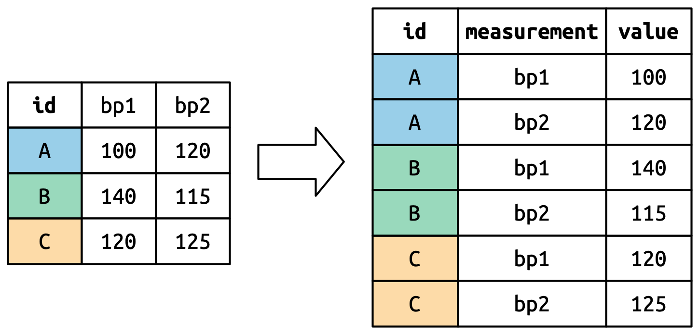

# Introducción {background-color="#2C3E50"}

## ¿Por qué ordenar datos?

::: incremental
- La mayoría de los datos reales están **desordenados**
- Organizar datos toma tiempo al inicio
- Pero ahorra **mucho más tiempo** después
- Con datos ordenados, el análisis es más fácil
- Las herramientas del tidyverse funcionan mejor con datos ordenados
:::

## Cargar paquetes

```{r}
library(tidyverse)
library(readxl)
library(janitor)
library(gapminder)
```

El paquete **tidyr** (parte de tidyverse) proporciona herramientas para ordenar datos.

# ¿Qué son datos tidy? {background-color="#2C3E50"}

## Los mismos datos, 3 formas diferentes 

**Tabla 1:**
```{r}
table1
```

## Los mismos datos, 3 formas diferentes 

**Tabla 2:**
```{r}
table2
```


## Los mismos datos, 3 formas diferentes 

**Tabla 3:**
```{r}
table3
```

. . .

::: question
¿Cuál es más fácil de usar?
:::

## Los tres principios de datos **tidy**

1. **Cada variable es una columna**
2. **Cada observación es una fila**
3. **Cada valor es una celda**

## Los tres principios de datos **tidy**

{fig-align="center"}

::: incremental
- Variables → Columnas
- Observaciones → Filas
- Valores → Celdas
:::

## ¿Por qué usar datos tidy?

::: incremental
1. **Consistencia**: Una forma estándar de almacenar datos
   - Fácil aprender herramientas que funcionan con esta estructura
   - Todas tienen uniformidad subyacente

2. **Naturaleza vectorizada de R**:
   - Variables en columnas permiten que R brille
   - Funciones de R trabajan con vectores de valores
   - Transformar datos tidy es natural
:::

## Ejemplo: Trabajar con datos tidy 

```{r}
# Calcular tasa por 10,000 habitantes
table1 |>
  mutate(rate = cases / population * 10000)
```
. . .

```{r}
# Casos totales por año
table1 |>
  group_by(year) |>
  summarize(total_cases = sum(cases))
```

## Visualizar datos tidy

```{r}
ggplot(table1, aes(x = year, y = cases)) +
  geom_line(aes(group = country), color = "grey50") +
  geom_point(aes(color = country, shape = country)) +
  scale_x_continuous(breaks = c(1999, 2000))
```

::: callout-tip
Con datos tidy, crear visualizaciones es directo y simple
:::

# Formato largo | pivot_longer() {background-color="#2C3E50"}

## Problema común: Datos en nombres de columnas

La mayoría de datos reales están **desordenados** por dos razones:

::: incremental
1. Los datos se organizan para facilitar **entrada**, no análisis
2. La mayoría de personas no conocen principios de datos **tidy**
:::

. . .

**Solución**: `pivot_longer()` y `pivot_wider()`

## Ejemplo: Billboard

```{r}
billboard
```

## Problema con billboard


- Cada observación es una **canción**
- `artist`, `track`, `date.entered` son variables
- Pero `wk1`, `wk2`, ... `wk76` también son columnas
- Los **nombres de columnas** son valores de una variable (`week`)
- Los **valores de las celdas** son otra variable (`rank`)

## Solución: pivot_longer()

```{r}
indicadores_inei <- readxl::read_excel("data/indicadores_demograficos.xlsx", 
          range = "A4:AA20") |> 
  janitor::clean_names()
indicadores_inei

```


## Argumentos de pivot_longer()

```{r}
indicadores_inei |>
  pivot_longer(
    cols = amazonas:ancash,      # Qué columnas pivotar
    names_to = "departamento",   # Nombre de nueva columna (nombres)
    values_to = "valores"        # Nombre de nueva columna (valores)
  )
```

::: incremental
- **`cols`**: qué columnas pivotar (sintaxis de `select()`)
- **`names_to`**: nombre para la nueva variable de nombres de columnas
- **`values_to`**: nombre para la nueva variable de valores
:::


## ¿Cómo funciona pivot_longer()? 

Ejemplo simple:

```{r}
df <- tribble(
  ~id,  ~bp1, ~bp2,
   "A",  100,  120,
   "B",  140,  115,
   "C",  120,  125
)
```

. . .

```{r}
df |>
  pivot_longer(
    cols = bp1:bp2,
    names_to = "measurement",
    values_to = "value"
  )
```


## Mecánica de pivot_longer()

{fig-align="center"}

::: incremental
1. **Columnas existentes** se repiten (una vez por columna pivotada)
2. **Nombres de columnas** se convierten en valores
3. **Valores de celdas** se desenrollan fila por fila
:::


#  pivot_wider() | Formato Ancho {background-color="#2C3E50"}

## Cuando necesitas pivot_wider()

- Opuesto a `pivot_longer()`
- **Aumenta columnas**, **reduce filas**
- Útil cuando una observación está dispersa en múltiples filas
- Menos común en la práctica

## Ejemplo: Experiencia de pacientes

```{r}
gapminder |> 
  group_by(year, continent) |> 
  summarise(pop_promedio = mean(pop), 
            .groups = "drop") 
```


## Solución: pivot_wider()

```{r}
gapminder |> 
  group_by(year, continent) |> 
  summarise(pop_promedio = mean(pop), 
            .groups = "drop") |> 
  pivot_wider(names_from = year, 
              values_from = pop_promedio)
```

::: incremental
- `names_from`: columna existente que contiene los **nombres**
- `values_from`: columna existente que contiene los **valores**
:::


## ¿Cómo funciona pivot_wider()?

Ejemplo simple:

```{r}
df <- tribble(
  ~id, ~measurement, ~value,
  "A",        "bp1",    100,
  "B",        "bp1",    140,
  "B",        "bp2",    115,
  "A",        "bp2",    120,
  "A",        "bp3",    105
)
```

## Aplicar pivot_wider()

```{r}
df |>
  pivot_wider(
    names_from = measurement,
    values_from = value
  )
```


::: callout-note
NAs se crean cuando no hay valor correspondiente en la entrada
:::

## Mecánica de pivot_wider()

`pivot_wider()` sigue estos pasos:


1. Identifica qué irá en **columnas** (valores únicos de `names_from`)
2. Identifica qué irá en **filas** (variables no usadas = `id_cols`)
3. Crea data frame vacío combinando filas × columnas
4. Rellena celdas con valores de `values_from`


## Valores duplicados

¿Qué pasa si hay múltiples filas para la misma combinación?

```{r}
df <- tribble(
  ~id, ~measurement, ~value,
  "A",        "bp1",    100,
  "A",        "bp1",    102,  # Duplicado!
  "A",        "bp2",    120,
  "B",        "bp1",    140,
  "B",        "bp2",    115
)
```

## Resultado con duplicados 

```{r}
df |>
  pivot_wider(
    names_from = measurement,
    values_from = value
  )
```

::: callout-warning
Crea list-columns! Necesitas resolver duplicados primero
:::

## Encontrar duplicados

```{r}
df |>
  group_by(id, measurement) |>
  summarize(n = n(), .groups = "drop") |>
  filter(n > 1)
```


::: callout-tip
Investiga y resuelve el problema antes de pivotar
:::

# Ejemplo Práctico: Áreas Naturales {background-color="#2C3E50"}

## Datos de ejemplo

```{r}
library(readxl)

anp <- read_excel("data/areas_naturales_peru.xlsx") |>
  clean_names()

glimpse(anp)
```

## Alargar: Múltiples columnas de superficie

Supongamos que tenemos:

```{r}
anp_wide <- tribble(
  ~nombre,              ~superficie_2020, ~superficie_2021,
  "Parque Cutervo",     8214,             8214,
  "Reserva Pacaya",     2080000,          2080000,
  "Parque Manu",        1716295,          1716295
)
```

## Solución

```{r}
anp_long <- anp_wide |>
  pivot_longer(
    cols = starts_with("superficie"),
    names_to = "year",
    names_prefix = "superficie_",
    values_to = "superficie_ha"
  )

anp_long
```


## Ensanchar: De largo a ancho

```{r}
anp_long |>
  pivot_wider(
    names_from = year,
    names_prefix = "superficie_",
    values_from = superficie_ha
  )
```


# Resumen {background-color="#2C3E50"}

## Conceptos clave

::: incremental
- **Datos tidy**: variables en columnas, observaciones en filas, valores en celdas
- **pivot_longer()**: convertir columnas en filas (alargar)
- **pivot_wider()**: convertir filas en columnas (ensanchar)
- No hay "una" forma correcta - depende del análisis
- Está bien des-ordenar, transformar, y re-ordenar según necesites
:::

## Funciones principales

| Función | Uso |
|---------|-----|
| `pivot_longer()` | Alargar datos (columnas → filas) |
| `pivot_wider()` | Ensanchar datos (filas → columnas) |
| `names_to` | Nombre para nueva columna de nombres |
| `values_to` | Nombre para nueva columna de valores |
| `names_from` | De dónde tomar nombres de columnas |
| `values_from` | De dónde tomar valores |
| `names_sep` | Separador para dividir nombres |
| `.value` | Indicador especial para nombres variables |

## Argumentos importantes 

**pivot_longer():**

- `cols` - qué columnas pivotar
- `names_to` - nombre de nueva variable
- `values_to` - nombre de valores
- `values_drop_na` - eliminar NAs
- `names_sep` / `names_pattern` - dividir nombres
- `names_prefix` - remover prefijo

**pivot_wider():**

- `names_from` - columna con nombres
- `values_from` - columna con valores
- `id_cols` - columnas que identifican filas
- `names_prefix` - agregar prefijo
- `values_fill` - valor para celdas faltantes


## Consejos finales


1. **Empieza simple** - usa ejemplos pequeños para entender
2. **Visualiza** - dibuja cómo quieres que se vean los datos
3. **Itera** - prueba, revisa, ajusta
4. **Documenta** - comenta por qué pivoteas de cierta forma
5. **Sé pragmático** - la forma "correcta" es la que facilita tu análisis
6. **No tengas miedo** - des-ordenar y re-ordenar es normal


## Errores comunes

| Error | Solución |
|-------|----------|
| Olvidas especificar `names_to` o `values_to` | Ambos son requeridos en `pivot_longer()` |
| Múltiples filas por ID en `pivot_wider()` | Especifica `id_cols` correctamente |
| List-columns inesperadas | Tienes duplicados - usa `group_by() + summarize()` |
| NAs no deseados | Usa `values_drop_na = TRUE` |
| Tipos incorrectos después de pivotar | Usa `mutate()` para corregir tipos |

## Recursos adicionales

- [R for Data Science - Data Tidying](https://r4ds.hadley.nz/data-tidy)
- [tidyr vignette: Pivoting](https://tidyr.tidyverse.org/articles/pivot.html)
- [Tidy Data paper](https://www.jstatsoft.org/article/view/v059i10) - Teoría y fundamentos
- [tidyr documentation](https://tidyr.tidyverse.org/)
- [Data transformation cheatsheet](https://github.com/rstudio/cheatsheets/blob/main/tidyr.pdf)


## Contacto

::: {.columns}
::: {.column width="50%"}
**Paul Efren Santos Andrade**

📧 [Correo electrónico]

🌐 [paulefrensa.rbind.io](https://paulefrensa.rbind.io)

🐦 [@PaulEfrenSantos](https://twitter.com/PaulEfrenSantos)

💻 [github.com/PaulESantos](https://github.com/PaulESantos)
:::

::: {.column width="50%"}
{fig-align="center" width="60%" style="border-radius: 50% / 35%; object-fit: cover;"}
:::
:::

